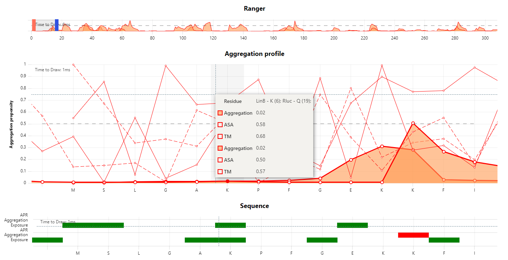

# JavaScript module for 2D visualization of selected protein properties



## Example
```js
import {makeChart} from './datachart.js';

/**
 * This is an example of the 2D module usage in JS apps
 */

// name of the json file that will be fetched
let json = 'HLDsData.json';

// create an optional config to configure chart
let config = {
    debug: true,
    legendAsTooltip: true,
    onAreaSelected: (min, max) => console.log(`area selected [${min}, ${max}]`), // area selected callback
    onResidueSelectedFromProfile: (positions) => {
        positions.forEach(p => console.log(p));
    },
}

const drawRect = (ctx, cx, cy, maxHeight, maxWidth) => {
    ctx.beginPath();
    ctx.rect(cx - maxWidth / 2, cy - maxHeight / 2, maxWidth * devicePixelRatio, maxHeight * devicePixelRatio);
    ctx.fill();
    ctx.stroke();
};

// fetch the file then use the data from the result 

let chartFunctions = null;
(async function() {
    const response = await fetch(json);
    const data = await response.json();
    const makechartData = {
        dataframes: data.map(p => ({
            proteinID: {
                data: p.name
            },
            res: {
                data: p.positions
            },
            aa: {
                data: p.aminoAcids
            },
            apr: {
                data: p.apr,
                sequence: {
                    stroke: 'black',
                    fill: 'black',
                    label: "APR",
                    display: (threshold, series, seriesIdx, dataIdx, data) => {
                        return data[seriesIdx][dataIdx] == 1;
                    },
                    draw: drawRect
                },
                exclusiveOrder: 0
            },
            agg: {
                data: p.aggreprot,
                ranger:{
                    stroke: 'red',
                    fill: 'rgba(255, 155, 84, 0.6)',
                    fillTo: 0,
                },
                profile: {
                    stroke: 'red',
                    fill: 'rgba(255, 155, 84, 0.6)',
                    fillTo: 0,
                    width: 3,
                    label: 'Aggregation',
                    points: {
                        size: 10
                    }
                },
                sequence: {
                    stroke: 'red',
                    fill: 'rgba(255, 155, 84, 0.6)',
                    label: "Aggregation", 
                    display: (threshold, series, seriesIdx, dataIdx, data) => {
                        return data[seriesIdx][dataIdx] > threshold;
                    },
                    draw: drawRect,
                }
            },
            asa: 
            {
                data: p.sasa,
                profile: {
                    stroke: 'red',
                    fill: null,
                    dash: [10, 5],
                    label: 'ASA',
                    points: {
                        size: 5
                    }
                },
                sequence: {
                    stroke: 'green',
                    fill: 'rgba(0, 255, 0, 0.2)',
                    label: "Exposure",
                    display: (threshold, series, seriesIdx, dataIdx, data) => {
                        return data[seriesIdx][dataIdx] > threshold;
                    },
                    draw: drawRect
                }
            },
            tm: {
                data: p.transmembrane,
                profile: {
                    stroke: 'red',
                    fill: null,
                    label: 'TM',
                    points: {
                        size: 5
                    }
                }
            },
        })),
    };
    chartFunctions = makeChart(makechartData, config, document.body)
        .setView(0, 15)
        .setYRange(0, 1);
})();
```

See the result [here](https://elliahu.github.io/datachart/). See the full example in example.js file.
